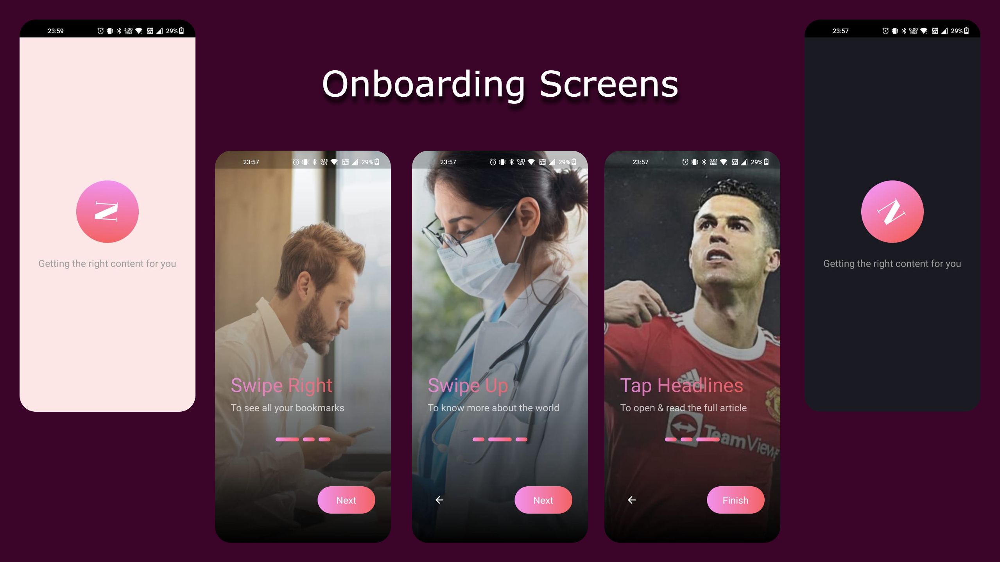
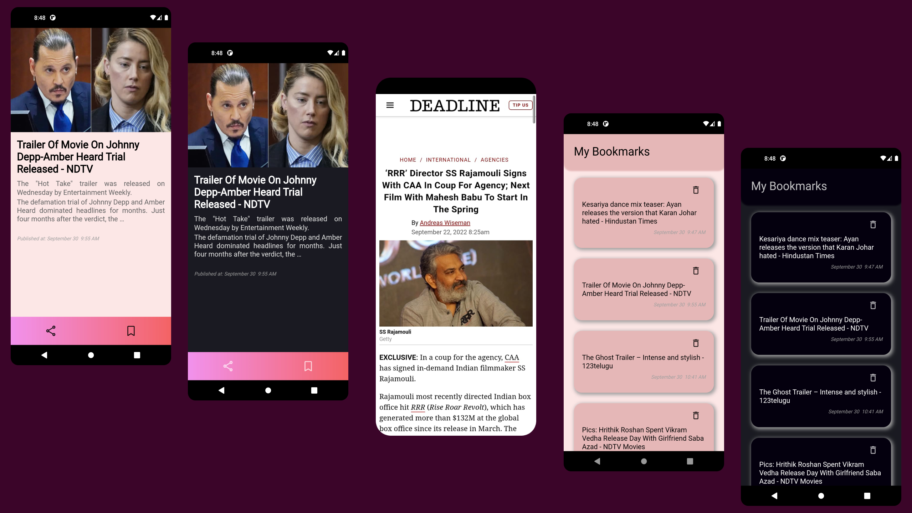

# News Shorts 📄 

An Application that provides you news shorts coming from the API service (NewsAPI.org). It can saves shorts as bookmarks locally. 

## Features 🚀

- Get the news articles as shorts.
- Shows the full article in WebView.
- Bookmark your favourite shorts locally.

## Download 📥
- Download latest APK from [here](https://github.com/insfirred/inshorts-clone/tree/features/apk)

## Onboarding Screens 

## HomeScreen, WebView, Bookmarks

## Maintainers
<table>
  <tbody><tr>
    <td align="center"><a href="https://github.com/insfirred"> <b>Developed by Kalash</b></a></td>
    <td align="center"><a href="https://github.com/iamshubhransh"> <b>Designed by Shubhransh</b></a></td>

  </tr>
</tbody></table>

## Permissions 💻
- Internet

### If you liked the project don't forget to star 🌟 and fork 🍽 the project.

